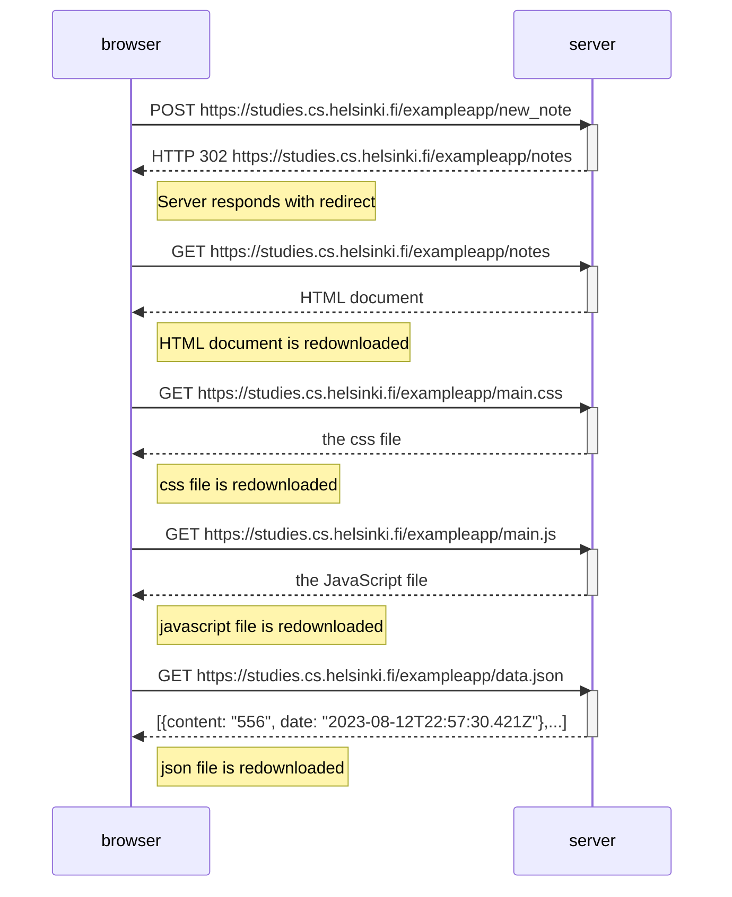

```mermaid

sequenceDiagram
    participant browser
    participant server


    browser->>server: POST https://studies.cs.helsinki.fi/exampleapp/new_note
    activate server
    server-->>browser: HTTP 302 https://studies.cs.helsinki.fi/exampleapp/notes
    deactivate server
    
    Note right of browser: Server responds with redirect
    
    browser->>server: GET https://studies.cs.helsinki.fi/exampleapp/notes
    activate server
    server-->>browser: HTML document
    deactivate server
    
    Note right of browser: HTML document is redownloaded

    browser->>server: GET https://studies.cs.helsinki.fi/exampleapp/main.css
    activate server
    server-->>browser: the css file
    deactivate server
    
    Note right of browser: css file is redownloaded

    browser->>server: GET https://studies.cs.helsinki.fi/exampleapp/main.js
    activate server
    server-->>browser: the JavaScript file
    deactivate server
    
    Note right of browser: javascript file is redownloaded
    
    browser->>server: GET https://studies.cs.helsinki.fi/exampleapp/data.json
    activate server
    server-->>browser: [{content: "556", date: "2023-08-12T22:57:30.421Z"},...]
    deactivate server    

    Note right of browser: json file is redownloaded

```